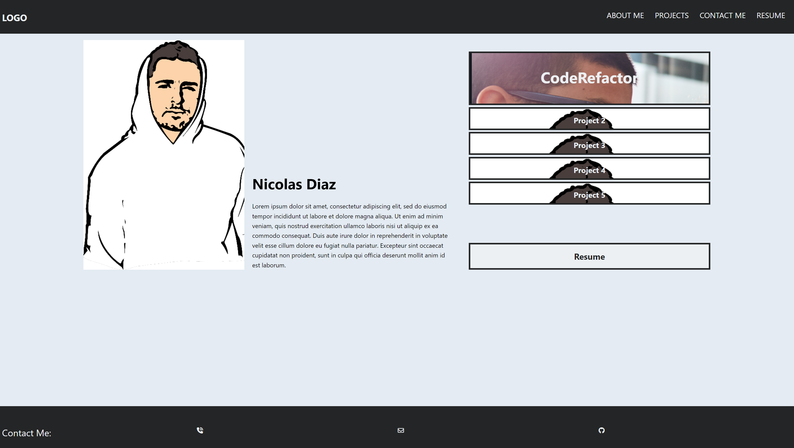
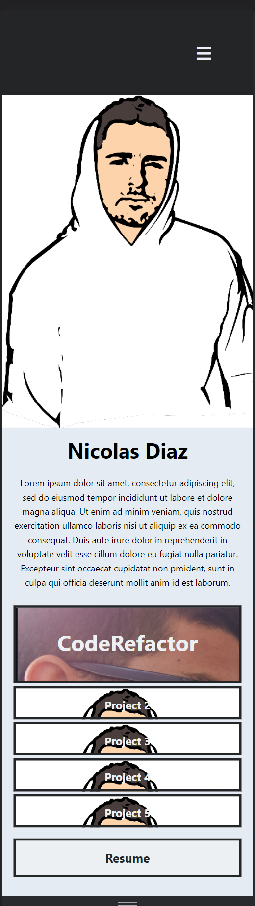
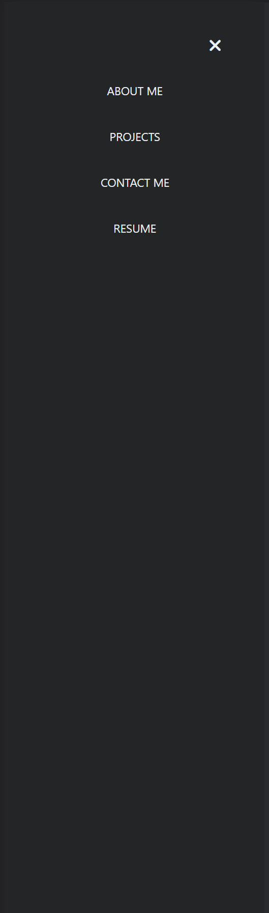

# professional-portfolio
A repository to hold the source code to my professional portfolio website. My deployed application may be viewed through the section titled ## Deployed application link. 

## Motivation
This project exists to professionally showcase my software development projects as I continue to build them out, and to provide a means for contacting me for questions, collaboration, and employment opppurtunities.

## Screenshots

Below are screenshot examples of the application, some of it's functionality, as well as it's mobile friendly mode:

## Tech/framework used
HTML & CSS

## Credits

Font Awesome & w3Schools for icons in footer (line 78-82 of index.html): 

https://fontawesome.com/ 

https://www.w3schools.com/icons/fontawesome_icons_intro.asp

Color palette from Adobe: https://color.adobe.com/mythemes

## Deployed application link

Deplyed application: http://127.0.0.1:5500/index.html#description

## How to use?
If potential employers are interested in discussing any oppurtunities, they may use the contact information (click the icons in the footer) to contact me via email, phone call, test, or through my github repo. If fellow creators would like to colaborate on future projects, I may contacted in the same form.

## License

MIT © [nicanthoni]()